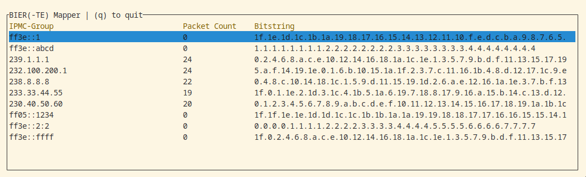

# eBIERpf - A minimal BFIR/BFER for network testing using eBPF



## Intro
eBIERpf is a transparent BIER extension for linux hosts.
Outgoing IPMC packets are mapped to a BIER header (if configured) which is then pushed in the egress processing.
Incoming BIER packets are decpasulated if the corresponding local decap bits are set.
The program is configured using a JSON file that sets a static BIER header for a given IPMC address.
Further, a wireshark dissector for analysing packets is provided in `bier.lua`.

## Config
See `config.json` for an example config.
`local` defines the local decap bits, `entries` is a dictionary of mappings from IPMC to BIER header.

## Running and Building the Program

Once built, you can run the program as follows
```
cargo run --release --config 'target."cfg(all())".runner="sudo -E"' -- --iface lo --config config.json
```
Currently the program can only bind to a single interface for receiving/sending BIER traffic.

### Prerequisites

1. stable rust toolchains: `rustup toolchain install stable`
1. nightly rust toolchains: `rustup toolchain install nightly --component rust-src`
1. (if cross-compiling) rustup target: `rustup target add ${ARCH}-unknown-linux-musl`
1. (if cross-compiling) LLVM: (e.g.) `brew install llvm` (on macOS)
1. (if cross-compiling) C toolchain: (e.g.) [`brew install filosottile/musl-cross/musl-cross`](https://github.com/FiloSottile/homebrew-musl-cross) (on macOS)
1. bpf-linker: `cargo install bpf-linker` (`--no-default-features` on macOS)

### Build & Run

Use `cargo build`, `cargo check`, etc. as normal. Run your program with:

```shell
cargo run --release --config 'target."cfg(all())".runner="sudo -E"'
```

Cargo build scripts are used to automatically build the eBPF correctly and include it in the
program.

### Cross-compiling on macOS

Cross compilation should work on both Intel and Apple Silicon Macs.

```shell
CC=${ARCH}-linux-musl-gcc cargo build --package testxdp --release \
  --target=${ARCH}-unknown-linux-musl \
  --config=target.${ARCH}-unknown-linux-musl.linker=\"${ARCH}-linux-musl-gcc\"
```
The cross-compiled program `target/${ARCH}-unknown-linux-musl/release/testxdp` can be
copied to a Linux server or VM and run there.

### License

With the exception of eBPF code, ebpf-bier is distributed under the terms
of either the [MIT license] or the [Apache License] (version 2.0), at your
option.

Unless you explicitly state otherwise, any contribution intentionally submitted
for inclusion in this crate by you, as defined in the Apache-2.0 license, shall
be dual licensed as above, without any additional terms or conditions.

#### eBPF

All eBPF code is distributed under either the terms of the
[GNU General Public License, Version 2] or the [MIT license], at your
option.

Unless you explicitly state otherwise, any contribution intentionally submitted
for inclusion in this project by you, as defined in the GPL-2 license, shall be
dual licensed as above, without any additional terms or conditions.

[Apache license]: LICENSE-APACHE
[MIT license]: LICENSE-MIT
[GNU General Public License, Version 2]: LICENSE-GPL2
